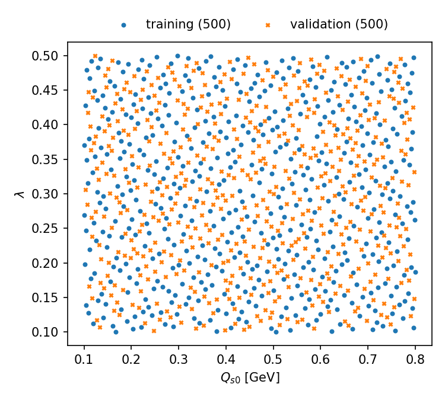
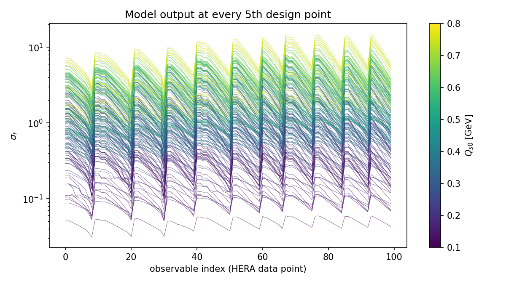
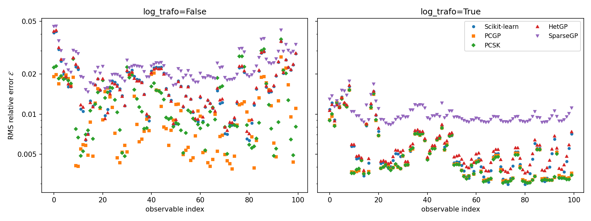
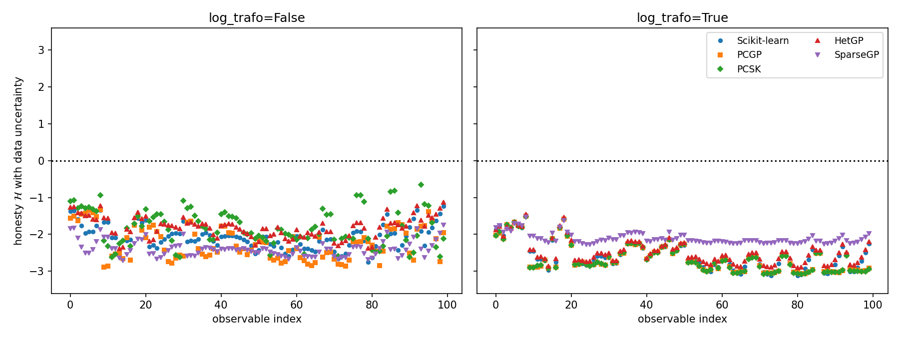
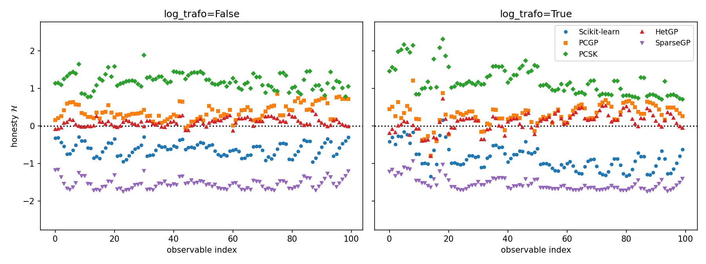
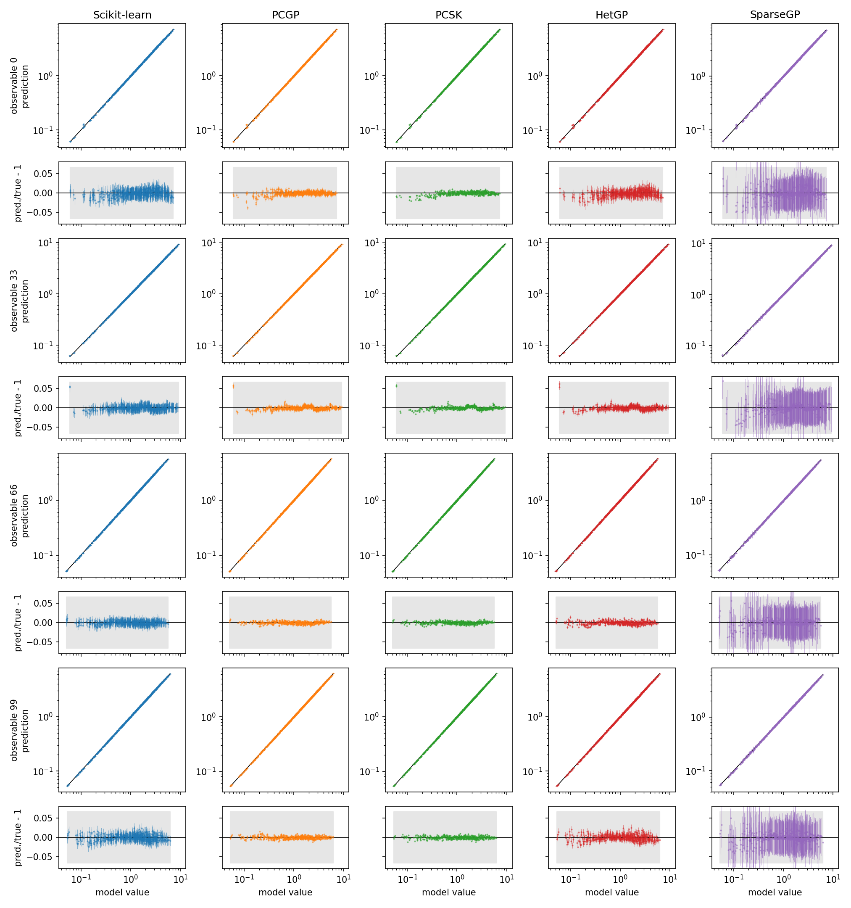
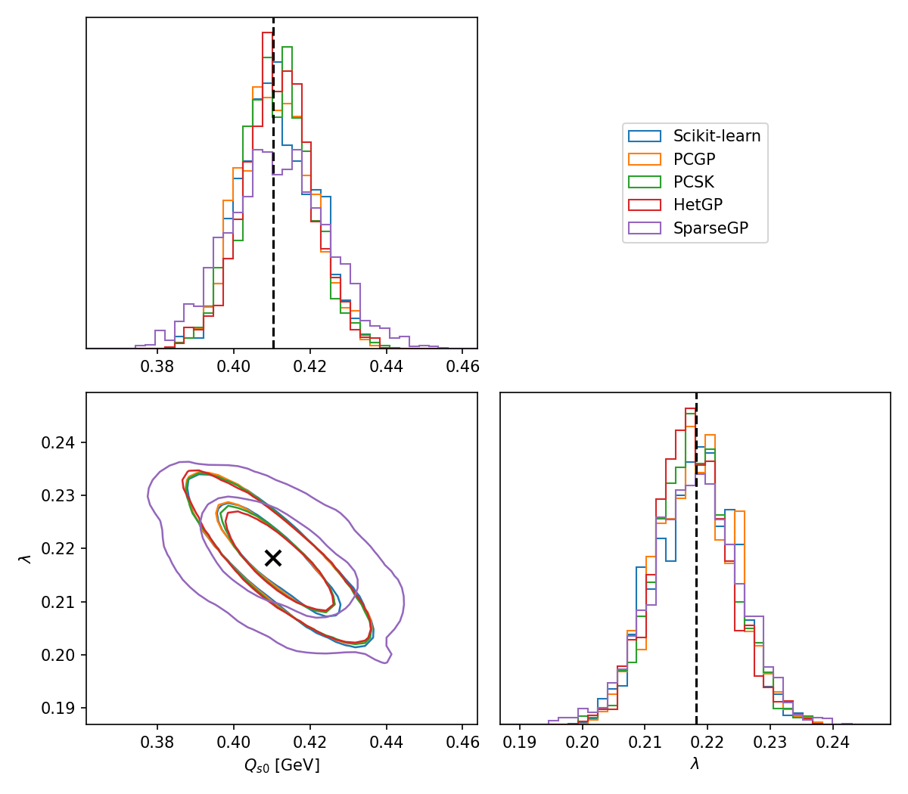
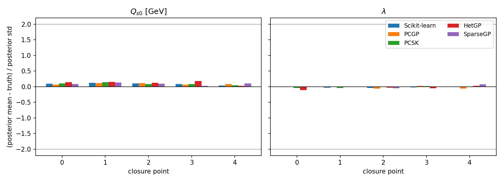
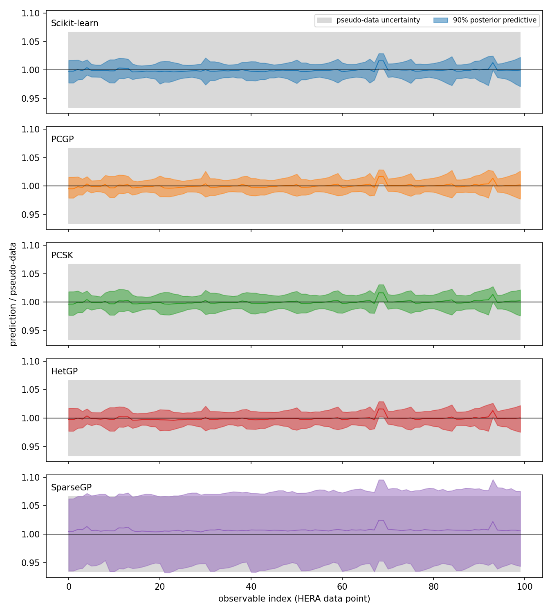

# Full Bayesian workflow: DIS example

This example goes through a complete Bayesian parameter estimation with `gpbayestools`: parameter
design, training data, training and validation of all emulators of the package, and closure tests
with pocoMC. It also compares the emulators with each other, both in their validation and in the
posteriors they give.

## The physics

The example is the fit of deep-inelastic scattering (DIS) data from HERA in
[A. Andronic et al., JHEP 04 (2026) 185](https://doi.org/10.1007/JHEP04(2026)185)
([arXiv:2504.02726](https://arxiv.org/abs/2504.02726)), where you can read more about the physics.
The proton is described by the Golec-Biernat–Wüsthoff (GBW) saturation model with the saturation
scale

$$Q_s^2(x) = Q_{s,0}^2\, x^{-\lambda}\, (1 - x).$$

| Parameter | Meaning | Prior range |
|---|---|---|
| $Q_{s,0}$ | saturation scale | 0.1–0.8 GeV |
| $\lambda$ | exponent of the $x$ dependence of the saturation scale | 0.1–0.5 |

The observables are the reduced cross sections $\sigma_r$ at the 100 data points of the combined
H1 and ZEUS measurement with $2\ \mathrm{GeV}^2 \le Q^2 \le 22\ \mathrm{GeV}^2$ and $x \le 0.01$.
The model was evaluated at 1000 design points of a maximum projection Latin hypercube. Every model
value has an uncertainty of 6.59%, which is the model uncertainty of the paper, not a statistical
error: the model output is noise-free.

## Contents

| File | Content |
|---|---|
| [`01_design_and_data.ipynb`](01_design_and_data.ipynb) | parameter file, design generation, format of the training data |
| [`02_emulator_comparison.ipynb`](02_emulator_comparison.ipynb) | training and validation of all emulators, with and without log transformation |
| [`03_closure_tests.ipynb`](03_closure_tests.ipynb) | posteriors of all emulators for pseudo-data with known parameters |
| `data/parameters_DIS.txt` | parameter file |
| `data/training_data_DIS.pkl` | model output at the 1000 design points |
| `figures/` | the figures shown below, written by the notebooks |

The notebooks write the trained emulators and the chains to `output/`, which is not part of the
repository. Run them in this directory and in this order. With the package installed with
`pip install ".[examples]"` (see the main [README](../../README.md)), notebook 2 takes about 25
minutes and notebook 3 about 15 minutes on a laptop.

The notebooks are stored without outputs. The figures below are from a run of the notebooks and
are only updated when the notebooks are run again.

## Step 1: parameter design and training data

The parameter file defines the names, labels and prior ranges of the parameters. The design points
are generated with `gpbayestools.design.Design` (R with the MaxPro or lhs package is required), and
the model is run at each of them. The output is collected in a pickle file with the parameters, the
values and the uncertainties of the observables at each design point.

The first 500 design points are used for the training, the remaining 500 for the validation and
the closure tests. MaxPro designs are ordered such that the first points also fill the parameter
space.

  
  

## Step 2: emulator comparison

All five emulators are trained on the first 500 design points, once on the observables and once
on their logarithm (`log_trafo=True`). Since the model output is noise-free, all emulators get
`errors_are_noise=False` (PCSK always treats the uncertainties as noise). The emulators are
validated on the other 500 points with the two metrics of
[arXiv:2405.12019](https://arxiv.org/abs/2405.12019) for each observable:

- the RMS relative error $\mathcal{E} = \sqrt{\langle((\mu - y)/y)^2\rangle}$ of the prediction
  $\mu$ at the model value $y$,
- the honesty $\mathcal{H} = \ln\sqrt{\langle(\mu - y)^2/\sigma^2\rangle}$, which is 0 if the
  predicted uncertainty $\sigma$ is calibrated, positive if the emulator is overconfident and
  negative if it is conservative. As in arXiv:2405.12019, $\sigma$ combines the emulator
  uncertainty and the uncertainty of the validation data (which also enter the likelihood).
  Since the model output here is noise-free, the honesty with the emulator uncertainty alone is
  shown as well.

| Emulator (`log_trafo=True`) | mean $\mathcal{E}$ | mean $\mathcal{H}$ | mean $\mathcal{H}$ with data uncertainty | training time |
|---|---|---|---|---|
| Scikit-learn (`EmulatorSklearn`) | 0.56% | −0.87 | −2.57 | 13 s |
| PCGP (`EmulatorBAND`) | 0.52% | 0.29 | −2.64 | 2 s |
| PCSK (`EmulatorBAND`) | 0.52% | 1.19 | −2.65 | 0.3 s |
| HetGP (`EmulatorHetGP`) | 0.60% | 0.11 | −2.48 | 190 s |
| SparseGP (`EmulatorSparseGP`) | 1.01% | −1.55 | −2.11 | 170 s |

The log transformation reduces the errors of all emulators by a factor of 2–3. PCSK is
overconfident for noise-free simulations since it models the uncertainties as noise, and SparseGP
is conservative, as expected for a sparse variational GP with fewer inducing points than training
points. For all emulators the errors are much smaller than the 6.59% data uncertainty.

  
  
  

The panels show $\mathcal{E}$, $\mathcal{H}$ with the data uncertainty and $\mathcal{H}$ with
the emulator uncertainty alone for each observable.

For four observables, the predictions of the log-trained emulators against the model values, with
the relative residuals below each panel:

  

## Step 3: closure tests

The pseudo-data are the model values at five validation points, with the 6.59% uncertainty and
without random fluctuations. For each point and each log-trained emulator, pocoMC samples the
posterior with a uniform prior. The first point is the validation point closest to the maximum a
posteriori parameters of the HERA fit in the paper ($Q_{s,0} = 0.393$ GeV, $\lambda = 0.219$).

  

All emulators recover the true parameters at all points within about 0.2 posterior standard
deviations, and the parameters are determined to about 2–3%. The posteriors of Scikit-learn, PCGP,
PCSK and HetGP are practically identical, those of SparseGP are 10–40% wider because of its larger
uncertainty.

  
  

For real data, the pseudo-data are replaced by the measurement, log-transformed like the
pseudo-data when the emulators use `log_trafo=True`.
